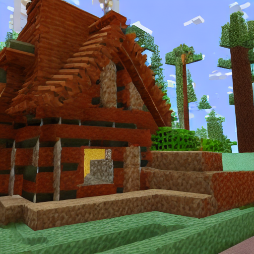

# Minecraft Style Stable Diffusion

This repository contains a complete implementation of a LoRA fine-tuning system for Stable Diffusion 1.5, trained to generate images in a Minecraft visual style. The project includes tools for both training custom LoRA weights and inferring images using pre-trained weights.

## Examples

Below are examples showing the difference between the base Stable Diffusion 1.5 model and the same model with the Minecraft LoRA adapter applied. Both images were generated with the same prompt "A cabin in the woods" and the same seed (0) for direct comparison:

### Base SD 1.5 Output


### Minecraft LoRA Applied


## Project Overview

The Minecraft Style Stable Diffusion project allows you to generate Minecraft-like images from text prompts. It works by applying a LoRA adapter to the base Stable Diffusion 1.5 model, which shifts the model's output toward a Minecraft aesthetic without changing the base model itself.

## Features

- **Pre-trained Minecraft LoRA**: Use the pre-trained LoRA weights from Hugging Face (TristanJLegg/MinecraftStyleStableDiffusion)
- **Custom Training**: Train your own LoRA weights using the provided training script
- **Inference Tool**: Generate Minecraft-style images from text prompts
- **Custom Dataset**: Uses the TristanJLegg/MinecraftGameplayCaptioned dataset created specifically for this project

## Getting Started

### Prerequisites

This project was tested using Python 3.10.14. It's recommended to install packages in this order:

```bash
pip install torch torchvision torchaudio --index-url https://download.pytorch.org/whl/cu118

pip install -r requirements.txt
```

### Generating Images with Pre-trained Weights

To generate images using the pre-trained Minecraft LoRA weights:

```bash
python infer.py "A cabin in the woods"
```

By default, this will pull the Minecraft LoRA weights from Hugging Face and apply them to Stable Diffusion 1.5.

#### Additional Options

Use the `--help` flag to see all available options:

```bash
python infer.py --help
```

Parameters:
- `--lora_weights`: Specify a different LoRA weights path or Hugging Face repo
- `--output_file`: Custom filename for the output image
- `--seed`: Set a specific seed for reproducible generation

### Training Your Own LoRA

To train your own Minecraft LoRA adapter:

```bash
python train.py
```

This will train a LoRA adapter using the TristanJLegg/MinecraftGameplayCaptioned dataset, which contains Minecraft gameplay screenshots paired with descriptive captions.

#### Customising Training

Use the `--help` flag to see all available training options:

```bash
python train.py --help
```

Parameters:
- `--weights_name`: Custom filename for the output weights
- `--lora_rank`: Rank of the LoRA adapter
- `--lr`: Learning rate
- `--resolution`: Image resolution for training
- `--max_train_steps`: Maximum number of training steps
- `--batch_size`: Batch size for training

## Contact

If you have any questions about this project or are interested in discussing deep learning research opportunities, academic collaborations, or potential roles please reach out to me at tristanjlegg@gmail.com.

## Acknowledgments

- This project uses the Stable Diffusion model by Runway
- The Minecraft dataset was created by gathering and captioning gameplay screenshots
